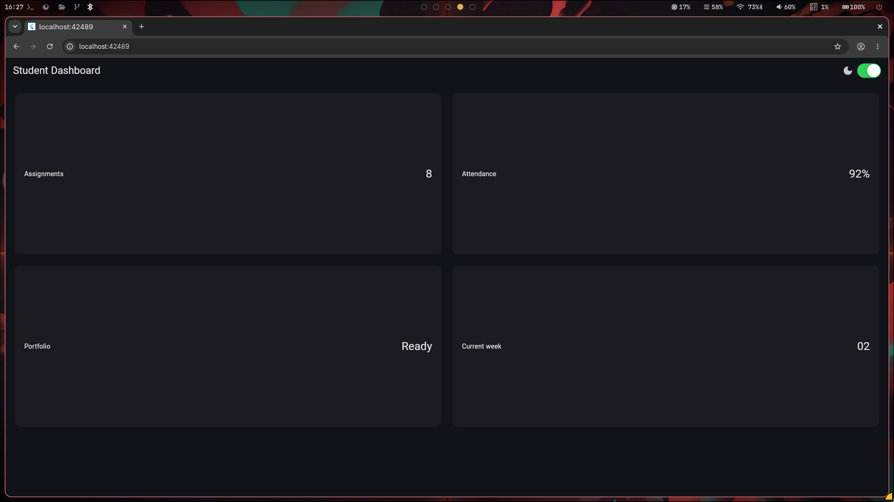

# Tugas Minggu 2: Declarative UI & Responsive Design (Student Dashboard)

Dokumen ini berisi rangkuman diskusi, keputusan arsitektur layout, analisis teknis trade-off responsivitas dan aksesibilitas, refactoring kode, bukti verifikasi pengujian, serta jawaban refleksi konseptual untuk aplikasi **Student Dashboard** menggunakan Flutter.

---

## 📌 Daftar Prompt & Pertanyaan Pengguna

1. **Prompt 1**:
   > *"Bandingkan dua tata letak dashboard akademik untuk Flutter: versi GridView dan versi LayoutBuilder + Column. Jelaskan trade-off responsif dan aksesibilitasnya"*
2. **Prompt 2**:
   > *"Jelaskan kapan penggunaan Expanded justru menyebabkan overflow di dalam Row, beri contoh kode yang gagal dan perbaikannya."*
3. **Prompt 3**:
   > *"Periksa kembali rekomendasi layout di atas: apakah tetap responsif di bawah 600px, apakah mengurangi aksesibilitas, dan apakah ada widget yang tidak tersedia di Flutter stabil saat ini?"*
4. **Prompt 4 (Refactoring Challenge & Responsive Testing)**:
   > *"Setelah tugas utama berjalan, rapikan kode Anda: Ekstrak kartu informasi menjadi widget reusable (InfoCard), ganti warna/ukuran dengan Theme.of(context), pindahkan breakpoint ke konstanta (kWideBreakpoint = 700), dan tambahkan widget test responsif dengan tester.view."*
5. **Prompt 5 (Refleksi Konseptual & Jawaban Evaluasi)**:
   > *"Tambahkan pada readme bawah sendiri beserta jawaban mengenai perbedaan imperative vs declarative, penggunaan Expanded, dampak breakpoint & theme, serta verifikasi rekomendasi AI."*

---

## 🎯 Keputusan Arsitektur Layout & Refactoring

Berdasarkan analisis trade-off dan *refactoring challenge*, diimplementasikan struktur clean & reusable pada file [`declarative_ui/lib/main.dart`](declarative_ui/lib/main.dart):

1. **Konstanta Breakpoint Terpusat**:
   * Menambahkan `const double kWideBreakpoint = 700;` agar batasan layar lebar hanya didefinisikan satu kali secara terpusat.
2. **Ekstraksi Reusable Widget (`InfoCard`)**:
   * Membuat widget `InfoCard` yang menerima parameter `title` dan `value` untuk menghilangkan duplikasi kode kartu statistik.
3. **Penerapan Dynamic Theming (`Theme.of(context)`)**:
   * Mengganti pewarnaan dan ukuran font hardcoded menggunakan `Theme.of(context).colorScheme` dan `Theme.of(context).textTheme` sehingga mendukung tema terang (*light mode*) dan gelap (*dark mode*) secara otomatis.
4. **`LayoutBuilder` Adaptif**:
   * Mengatur `crossAxisCount` pada `GridView`: **2 kolom** jika `maxWidth >= kWideBreakpoint` dan **1 kolom** di layar sempit.

---

## 🔬 Output Penting & Alasan Teknis (Technical Rationale)

### 1. Perbandingan Layout: `GridView` vs `LayoutBuilder + Column`

| Parameter | GridView | LayoutBuilder + Column | Keputusan Hybrid (Implementasi) |
| :--- | :--- | :--- | :--- |
| **Responsivitas Homogen** | Sangat Baik (Matriks teratur) | Sedang (Perlu pembagian `Row`/`Wrap`) | Menggunakan `GridView.count` dengan `InfoCard` reusable |
| **Flexibility Konten Dinamis** | Kaku (Terkunci `childAspectRatio`) | Sangat Fleksibel (*Content-driven height*) | Profil Mahasiswa menggunakan `Column` + `Row` fleksibel |
| **Text Scaling (> 1.5x)** | Berisiko *Text Clipping* / *Overflow* | Aman (Tumbuh vertikal sesuai teks) | Profil tumbuh vertikal; Grid disesuaikan dengan kolom adaptif |
| **Hierarki Screen Reader (A11y)** | Pembacaan Grid (Kiri-ke-Kanan) | Urutan Urut Sesuai Prioritas UI | Prioritas membaca Profil Mahasiswa dahulu baru Statistik |

### 2. Kapan `Expanded` Menyebabkan Overflow di Dalam `Row`?

* **Skenario Unbounded Width**: `Expanded` di dalam `Row` yang berada di dalam `SingleChildScrollView(scrollDirection: Axis.horizontal)` akan menyebabkan error `incoming width constraints are unbounded` karena sisa ruang bernilai $\infty$.
  * *Solusi*: Hapus `Expanded` jika menggunakan *scroll* horizontal, atau buang `SingleChildScrollView` jika ingin teks membungkus (*wrap*) di dalam batas layar.
* **Skenario Vertical Overflow**: `Expanded` pada `Row` hanya melebarkan sumbu horizontal (*Main Axis*), bukan sumbu vertikal (*Cross Axis*). Jika teks terlalu panjang dalam `Row` bertinggi terbatas (misal `SizedBox(height: 40)`), teks akan melimpah ke bawah (*Bottom Overflow*).
  * *Solusi*: Batasi baris teks dengan `maxLines: 1` + `TextOverflow.ellipsis` atau biarkan tinggi `Row` fleksibel.

### 3. Evaluasi Layar < 600px & Aksesibilitas

* **Responsivitas < 600px**: Tetap aman dan rapi karena `crossAxisCount` menyusut menjadi **1 Kolom**, mencegah kartu menjadi terlalu sempit.
* **Aksesibilitas (A11y)**: Menggunakan `Semantics` jika teks dipotong dengan `ellipsis` agar pembaca layar (TalkBack / VoiceOver) tetap membaca informasi utuh.
* **Ketersediaan Widget**: 100% widget yang digunakan (`LayoutBuilder`, `Column`, `Row`, `GridView`, `Expanded`, `Semantics`, dll.) adalah widget bawaan resmi yang **stabil** di Flutter SDK.

---

## 🧪 Bukti Verifikasi & Pengujian

### 1. Static Code Analysis (`flutter analyze`)
Jalankan analisis kualitatif kode untuk memastikan tidak ada warning maupun error linting baru:
```bash
$ flutter analyze
Analyzing declarative_ui...
No issues found! (ran in 0.5s)
```

### 2. Pengujian Otomatis Responsif (`flutter test`)
Pengujian responsif diuji pada [`declarative_ui/test/widget_test.dart`](declarative_ui/test/widget_test.dart) menggunakan `tester.view.physicalSize` untuk mensimulasikan layar sempit (400px) dan layar lebar (1200px). Hasil pengujian disimpan di [`declarative_ui/test/test_results.txt`](declarative_ui/test/test_results.txt):

```bash
$ flutter test
00:00 +0: loading test/widget_test.dart
00:00 +0: Dashboard satu kolom di layar sempit
00:00 +1: Dashboard dua kolom di layar lebar
00:00 +2: All tests passed!
```

### 3. Tangkapan Layar Tampilan UI (Screenshots)

Berikut adalah bukti visual antarmuka **Student Dashboard**:

| Mode Tampilan / Layout | Screenshot |
| :--- | :--- |
| **Student Dashboard (Light/Dark Mode & Responsive Layout)** |  |
| **Detail Kartu & Responsivitas Layout** |  |

---

## 💭 Refleksi Konseptual & Jawaban Evaluasi

### 1. Imperative dan Declarative UI

Kalau **imperative**, kita lebih fokus ke gimana cara mengubah UI-nya secara manual. Misalnya kita ubah text atau visibility widget satu per satu.

Kalau **declarative**, kita cukup menentukan UI-nya mau seperti apa berdasarkan state. Jadi kalau state berubah, Flutter yang akan menyesuaikan tampilan UI-nya.

### 2. Penggunaan `Expanded`

`Expanded` biasanya membantu kalau dipakai di `Row`, `Column`, atau `Flex` yang punya ukuran ruang yang jelas. Contohnya untuk membagi ruang yang tersedia supaya layout tidak overflow.

Tapi kalau dipakai di kondisi yang ruangnya tidak terbatas, seperti beberapa kasus di `ListView` atau `SingleChildScrollView`, malah bisa menyebabkan error karena `Expanded` tidak tahu batas ruang yang harus diambil.

### 3. Breakpoint dan Theme

**Breakpoint** berguna supaya tampilan bisa menyesuaikan ukuran layar. Misalnya di HP satu kolom, sedangkan di layar yang lebih besar jadi dua kolom. Jadi tampilannya lebih nyaman dilihat.

Sedangkan **Theme** digunakan supaya tampilan aplikasi tetap konsisten, termasuk untuk mengatur light mode dan dark mode.

### 4. Verifikasi Rekomendasi AI

Setelah dapat rekomendasi dari AI, saya tetap cek lagi apakah memang bisa digunakan dan sesuai dengan Flutter yang dipakai. Saya juga menjalankan `flutter analyze` untuk melihat apakah ada error atau warning.

Selain itu, saya coba test beberapa ukuran layar untuk memastikan layout responsif, dan saya cek juga kondisi seperti teks yang panjang supaya tidak langsung overflow atau terpotong.

---
*Dikembangkan oleh: Radit Firansah (NIM: 244107020196)*
